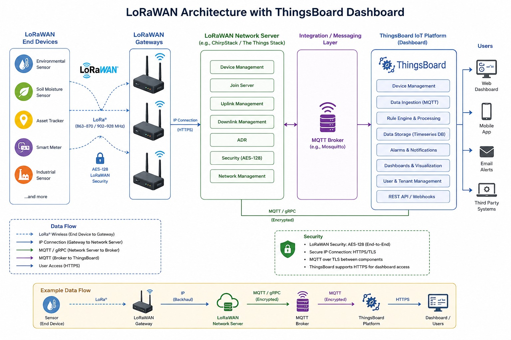
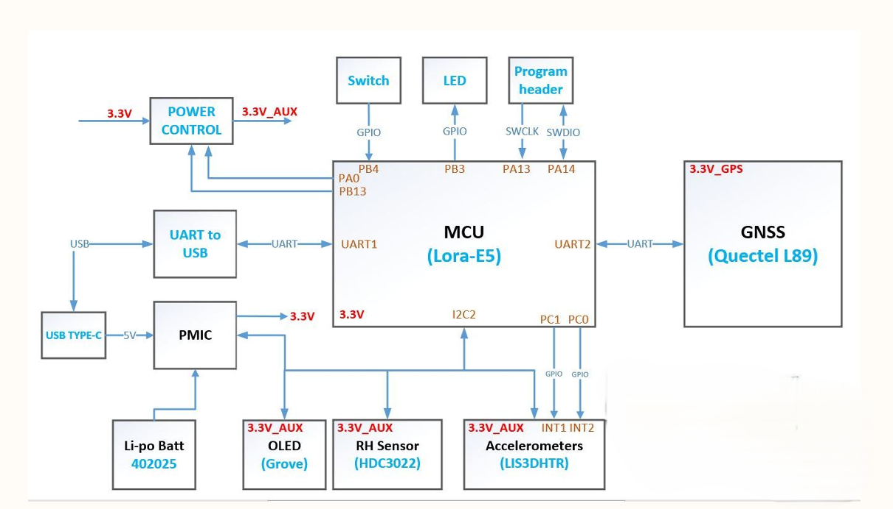
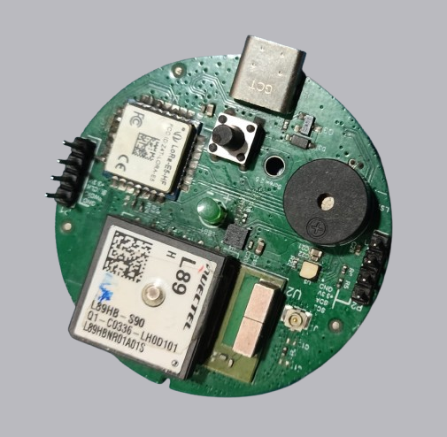
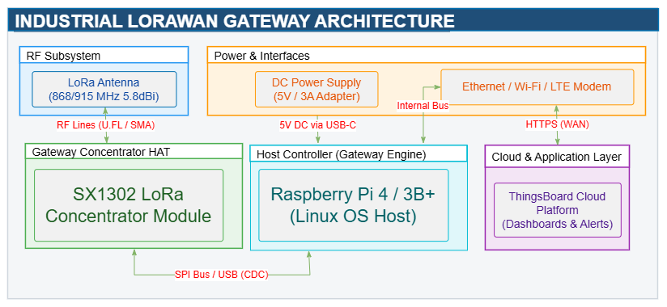
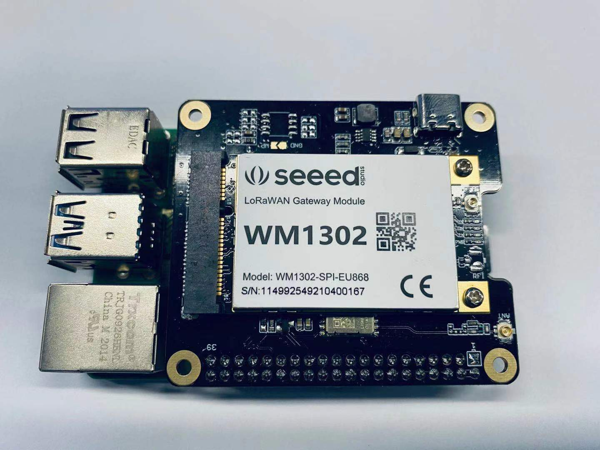

= TinyML-Enabled Industrial Machine Vibration Sensing and Monitoring Using LoRaWAN
:author: Neevee
:revdate: 2026-08-12
:toc: left
:toclevels: 3
:icons: font

== Abstract

In modern smart manufacturing, early detection of mechanical abnormalities is essential for preventing catastrophic machine failures. A conventional IoT-based vibration monitoring system requires high bandwidth and high power demands to stream continuous raw data to the cloud.

We propose a high-precision accelerometer, a smart ambient sensor, and an ultra-low-power microcontroller that executes an optimized TinyML classifier on-device to continuously analyze vibration patterns and detect mechanical faults at the edge. By processing raw vibration signals locally, the system sends only lightweight fault alerts and status telemetry, along with temperature and humidity, over a long range via a low-power LoRaWAN network. This approach eliminates cloud processing latency, drastically lowers power consumption, and reduces network bandwidth utilization. The resulting system provides an energy-efficient, long-range, and highly scalable solution for real-time predictive maintenance in an industrial environment.

---

== 1. System Architecture

The overall system architecture follows an end-to-edge-to-cloud topology designed for low-power, wide-area industrial predictive maintenance.

.System Architecture Block Diagram

=== 1.1 Data Flow Description

1. **Edge Perception & Inference (End Node):** 
   * High-frequency 3-axis vibration data is captured continuously by the *LIS3DHTR* accelerometer.
   * Ambient temperature and relative humidity are read periodically from the *SHT40* sensor via the I2C bus.
   * An optimized **TinyML model** running locally on the **LoRa-E5 System-in-Package** processes high-rate raw vibration vectors locally to detect anomaly signatures.
2. **LoRaWAN Uplink:**
   * Instead of streaming raw vibration waveforms, the MCU packages lightweight payload packets (Fault Status Code + Temperature + Humidity + Battery telemetry) and transmits them wirelessly using end-to-end encrypted LoRaWAN frames.
3. **Gateway Ingestion:**
   * An **SX1302-based LoRa Gateway** driven by a **Raspberry Pi** receives packet signals across multi-channel frequencies and forwards IP traffic to the LoRaWAN Network Server (LNS).
4. **Network & Application Processing:**
   * The LNS (ChirpStack / The Things Stack) handles frame de-duplication, Adaptive Data Rate (ADR), and routing.
   * Payload decoders parse telemetry data and push it via an **MQTT Broker** to the **ThingsBoard IoT Platform**.
5. **Visualization & Action:**
   * ThingsBoard provides real-time dashboards, historical trend tracking, and automated alert triggering (Email/SMS/Webhooks) upon anomaly detection.

---

== 2. Hardware Block Diagram

The on-board hardware architecture for the TinyML End Node and the Gateway Base Station is detailed below.

=== 2.1 End Node Block Diagram

.TinyML End Node Hardware Block Diagram

.TinyML End Node Image

=== 2.2 Gateway Architecture Block Diagram

.Gateway Hardware Block Diagram

.TinyML GGateway Image

== 3. Hardware Requirements

=== 3.1 End Node Subsystem Hardware Specifications

[cols="1,2,3", options="header"]
|===
| Component Category | Component / Module | Description & Interface

| **Main Processing Unit**
| Seeed Studio LoRa-E5 (STM32WLE5JC)
| Ultra-low-power ARM Cortex-M4 MCU @ 48MHz with 256KB Flash / 64KB SRAM. Runs on-device TinyML anomaly inference models and integrates the LoRaWAN stack.

| **Vibration Sensor**
| STMicroelectronics LIS3DHTR
| 3-Axis ultra-low-power high-performance linear accelerometer connected via I2C (I2C2). Configured with dual interrupt lines (`INT1`, `INT2`) for threshold trigger wake-up.

| **Ambient Sensing**
| Texas Instruments SHT40
| Precision relative humidity and temperature sensor on I2C bus. Provides ambient condition telemetry alongside vibration state data.

| **Power Management (PMIC)**
| MPS MP2667GG-0000-P
| Li-ion/Li-Po battery charger circuit supporting Type-C 5V power input, dynamic path management, and standard charging profiles.

| **Voltage Regulation**
| TI TPS73633DBVRG4 & TPS2052BDR
| Ultra-low noise 3.3V LDO for system supply alongside controlled power switches (`3.3V_AUX`, `3.3V_GPS`) for sub-circuit dynamic power-gating.

| **USB-to-UART Interface**
| Silicon Labs CP2102
| On-board USB to TTL serial conversion bridge for configuration, firmware flashing, and real-time debug streaming.

| **Optional GNSS**
| Quectel L89
| Multi-GNSS module connected over `UART2` for location tracking in mobile asset monitoring applications.

| **Display & User I/O**
| Grove OLED Connector, LED & Switch
| Grove 4-pin I2C interface for diagnostic status display, alongside system status LEDs and configurable pushbuttons.

| **Power Source**
| Li-Po Battery
| 3.7V rechargeable lithium polymer battery cell.
|===

=== 3.2 Gateway Subsystem Hardware Specifications

[cols="1,2,3", options="header"]
|===
| Component Category | Component / Module | Description & Interface

| **LoRa Baseband Concentrator**
| SX1302 LoRa Gateway Module
| High-capacity multi-channel LoRaWAN gateway chip capable of simultaneous packet reception over 8 channels with low power dissipation.

| **Host Computer Board**
| Raspberry Pi 4 Model B
| Single-board computer acting as the local Gateway Host, running packet forwarder daemons, local LNS (optional ChirpStack container), and MQTT bridging.

| **Antenna Subsystem**
| High-Gain Omni-Directional LoRa Antenna
| 868 MHz / 915 MHz industrial fiber-glass antenna  connected via U.FL to SMA connector adapter.

| **Power Supply**
| 5V / 3A DC Power Adapter
| Dedicated stable power input for Raspberry Pi base unit and attached HAT modules.

| **Network Backhaul**
| Ethernet / Dual-band Wi-Fi / LTE Modem
| Provides uplink transport connectivity from the gateway backhaul to the cloud/ThingsBoard platform.
|===

---

== 4. Summary of Operational Advantages

* **Edge Intelligence:** Eliminates raw sensor streaming latency and bandwidth limits by running TinyML directly on the STM32WLE5 MCU.
* **Minimal Power Consumption:** Uses power-gated sensors, dynamic sleep cycles, and low-payload LoRaWAN uplinks to allow multi-year battery operation.
* **End-to-End Scalability:** Compatible with standard LoRaWAN network servers and modular visualization platforms like ThingsBoard.